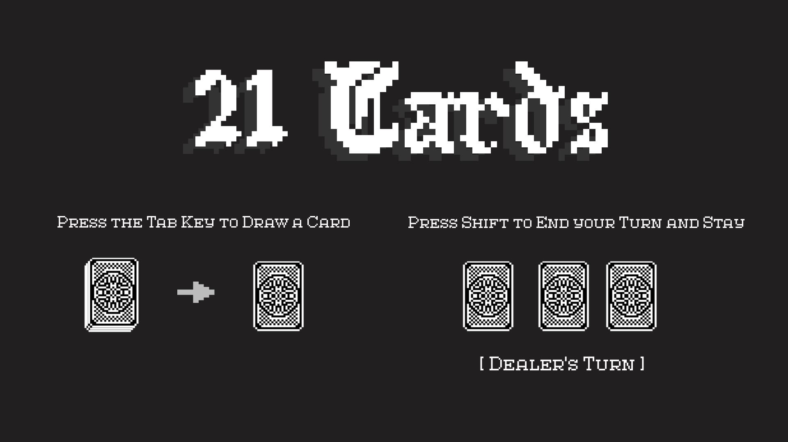
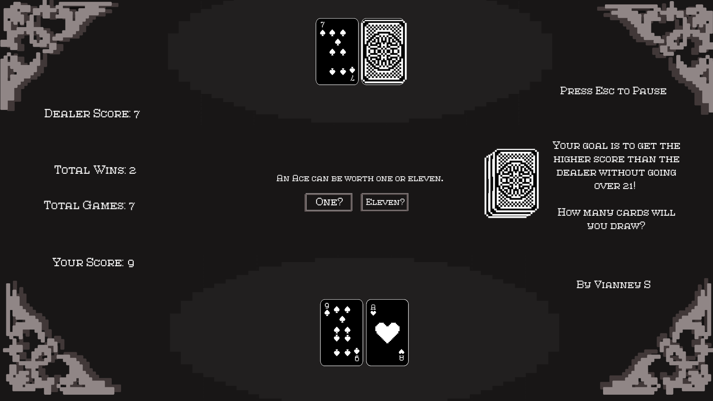
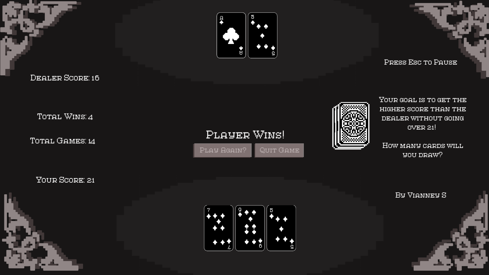

# PCC-Program-Submission - 21 Cards

By Vianney Susanto
---
## Introduction
This repository includes my submission of the 21-card game for **PointClickCare's Early Tech Talent Incubator Program**. 
21 Cards was made using the Unity game engine, written in C#. 

## Game Rules
It's a _single-player game_, where the player competes with the AI dealer. 
The goal of the game is to attempt to collect as many points as they can to have a bigger hand than the dealer without going over 21.

- The dealer is dealt 1 card face up, and 1 card face down. The player is dealt 1 card.
- The player can choose to draw as many cards as they'd like to get a bigger hand than the dealer _without going over 21_.
- Once the player feels like they're done, they can choose to press _"Stay"_, which ends their turn and starts the dealer's
- The dealer's facedown card is revealed, and then the dealer continues to draw cards _until their hand is greater than 16_, where they'll stay.
- If either the dealer or the player goes over 21, their opponent automatically wins. If either get exactly 21, _they win automatically_.
- Aces are versatile, and can be _either worth a 1 or 11_, depending on the player's choice, unless their hand is already greater than 11, where it automatically beocomes 1.

## Game Controls
- Press **Tab** to draw a card from the deck or press the in-game _"Draw"_ button which can be used with the mouse as well.
- Press **Shift** to draw a card from the deck or press the in-game _"Stay"_ button which can be used with the mouse as well.
- Press **Escape** to pause the game, and quit from there, or wait until the end of the round, and the game will ask if you'd like to quit.

## Game Set-Up
### Download Set-up
1. Navigate into the **"FullBuild"** folder in this repository above, there'll be both the regular folder as well as **the zipped folder**, both **named "21Cards"**, to download and install.
  (Click on the zip file in the folder, then go in the top right corner and press "Download raw file".
3. Download the zip folder on to your PC, though the game was **built for Windows**.
4. Extract the zipped folder, then go into the newly extracted folder.
5. Open the file **"21cards.exe"**, which opens the game!

## Repository Navigation
- "Assets" contain all the images, sound effects, and prefabs used in the game
- "FullBuild" has both the standard and zipped folder of the full game itself, which can download if the link doesn't work
- "src" holds all of the scripts used in the game
- "Miscallaneous" holds all of the extra Unity folders and files, which are used in the background

## Game Demonstrations

